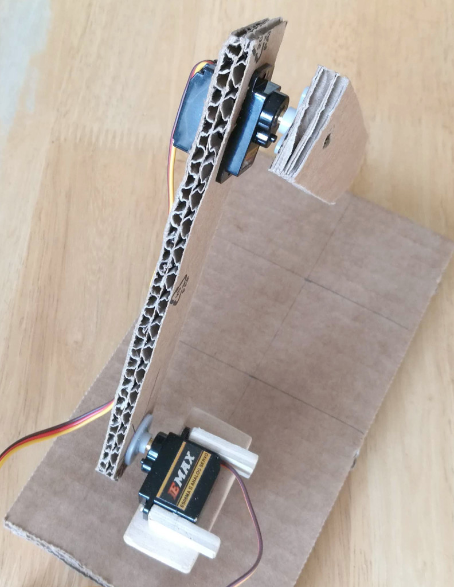

# Robot Arm
Robot arm with Arduino Nano.

## Idea
Idea for this robot arm was to make quick and cheap device for learning some algorithms needed for robot arm movements.
Interesting thing was to implement calculation to convert linear movement commands to servo angles.

Another (not yet implemented) idea was to add potentiometers to control movement in linear x, y and z directions, then Arduino will calculate needed servo angles.

See [Robot Arm in Action](https://www.youtube.com/watch?v=INLznvg_xrI)

## Parts
Many parts are done from cardboard, as it is easily available and easy to cut. Good for prototyping. Mounting part between rotation and shoulder servo was made from plywood.

**Electronics**
- Arduino Nano (just any microcontroller)
- 3 servos (e.g. EMAX ES08MA II miniservos)
- 5 V voltage regulator (e.g. L7805CV)
- 100 uF capacitor

**Other parts**
- base
  - Just hole for rotation servo body
- first arm
- second arm
- mounting part between rotation servo and shoulder servo

Robot arm parts. There is tight holes for servo bodys in base (for rotation servo) and first arm (for elbow servo).

Electronics

Rotation and shoulder servos, and mounting part between those.

Shoulder servo and mounting part

Shoulder (at bottom) and elbow

Elbow

## Schematics

